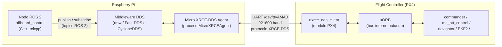
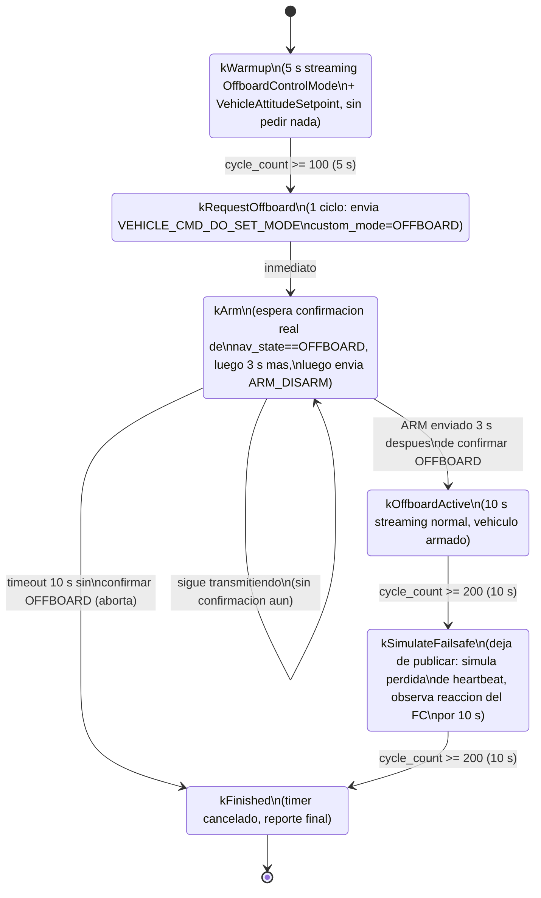
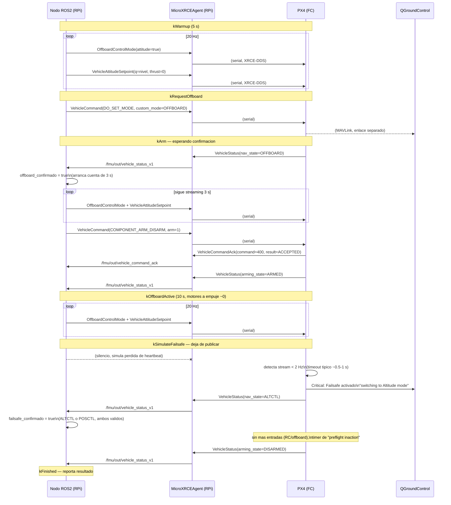

# `offboard_control` — Documentación de comunicación RPi ↔ FC

Este documento explica, paso a paso, cómo el nodo ROS 2 `offboard_control`
(paquete `px4_drone`) se comunica con el controlador de vuelo (FC) PX4 desde
la Raspberry Pi, qué mensajes intercambia, en qué orden, y por qué el flujo
está diseñado así. Incluye los hallazgos y gotchas descubiertos durante las
pruebas en hardware real.

Archivos fuente relevantes:
- `include/px4_drone/offboard_control.hpp`
- `src/offboard_control.cpp`
- `launch/offboard_control_cpp.launch.py`

**Estado:** ✅ Test de failsafe end-to-end verificado en hardware en **dos FC
distintos**: firmware v1.17 HKUST_NXT_DUAL (2026-07-23) y firmware v1.14
(2026-07-24, `release/1.14` @ `ffb6e80`) — mismo resultado en ambos: ARM
aceptado, `nav_state: OFFBOARD`, 10 s activo, motores girando correctamente
a empuje cero, simulación de pérdida de heartbeat, el FC se desarmó solo
(`*** FAILSAFE OK ***`). Ver sección 10 para los tres bugs de infraestructura
(no del nodo) que hubo que resolver la primera vez, y sección 11 para cómo
alternar entre firmwares/versiones de `px4_msgs`.

---

## 1. Propósito del nodo

`offboard_control` es un nodo de **prueba controlada**: arma el vehículo en
modo OFFBOARD sin despegar (actitud nivelada, empuje cero) y luego simula una
pérdida de heartbeat (deja de publicar setpoints) para verificar que el FC
reacciona con su failsafe correctamente (cambio de modo y/o desarme). No está
pensado para vuelo real, sino para validar la cadena de comunicación
RPi → FC y el comportamiento de seguridad del FC.

---

## 2. Arquitectura de la comunicación

El nodo nunca habla "directo" con PX4: todo pasa por el puente
**Micro XRCE-DDS**, que traduce entre DDS (lo que usa ROS 2) y el protocolo
XRCE-DDS ligero que corre dentro de PX4 sobre un enlace serial.



**Por qué existen dos "traductores" (Agent + cliente uXRCE-DDS):** ROS 2 habla
DDS nativo (pesado, pensado para redes Ethernet/WiFi). PX4 corre en un
microcontrolador con recursos limitados y un enlace serial de bajo ancho de
banda, así que implementa un cliente **XRCE-DDS** (versión ligera del
estándar). El `MicroXRCEAgent` en la RPi actúa de puente: del lado ROS 2 se ve
como un participante DDS normal: los topics `/fmu/in/*` y `/fmu/out/*`
aparecen en `ros2 topic list` como si PX4 fuera un nodo ROS 2 más, aunque en
realidad es un "bare DDS app" (por eso en `ros2 topic info -v` el lado de PX4
siempre aparece con `Topic type hash: INVALID`: no usa el sistema de
tipado de ROS 2, solo DDS puro).

---

## 3. Topics usados (todos vía el Agent, sobre el mismo puerto serial)

| Topic | Dirección | Tipo de mensaje | QoS (nuestro lado) | Propósito |
|---|---|---|---|---|
| `/fmu/in/offboard_control_mode` | RPi → FC | `OffboardControlMode` | best_effort, transient_local, depth 1 | Declara qué campo de control es válido (`attitude=true`). PX4 exige recibir este mensaje a >2 Hz para aceptar/mantener OFFBOARD. |
| `/fmu/in/vehicle_attitude_setpoint` + sufijo | RPi → FC | `VehicleAttitudeSetpoint` | igual | Setpoint de actitud: cuaternión nivelado `{1,0,0,0}`, empuje `{0,0,0}` (no se comanda despegue). |
| `/fmu/in/vehicle_command` | RPi → FC | `VehicleCommand` | igual | Comandos puntuales: `VEHICLE_CMD_DO_SET_MODE` (176) para pedir OFFBOARD, `VEHICLE_CMD_COMPONENT_ARM_DISARM` (400) para armar. |
| `/fmu/out/vehicle_status` + sufijo | FC → RPi | `VehicleStatus` | best_effort, depth 5 | Retroalimentación de `nav_state` (modo de navegación actual) y `arming_state` (armado/desarmado). |
| `/fmu/out/vehicle_command_ack` | FC → RPi | `VehicleCommandAck` | best_effort, depth 5 | Confirmación real del FC para cada comando enviado: `ACCEPTED`, `DENIED`, `TEMPORARILY_REJECTED`, etc. |

**Nota sobre el sufijo de versión:** varios mensajes PX4 (`VehicleStatus`,
`VehicleAttitudeSetpoint`, `VehicleLocalPosition`) tienen una versión
"congelada" (`_v1`, `_v2`, ...) además de la definición actual, para mantener
compatibilidad binaria entre versiones de PX4. El firmware agrega el sufijo
`_vN` a un topic **solo si** el mensaje tiene `MESSAGE_VERSION != 0` — no es
fijo, depende de qué versión de firmware/`px4_msgs` se esté usando (ver
sección 11: `topic_version_suffix` es ahora un **parámetro ROS** del nodo,
no un valor hardcodeado). Publicar/suscribir al nombre incorrecto no da
error, solo silencio total (el topic ni aparece en `ros2 topic list` hasta
que algo lo referencia).

---

## 4. Máquina de estados del nodo



Puntos clave de diseño (aprendidos a partir de fallos reales en banco de
pruebas):

- **El ARM no se pide a un conteo de ciclos fijo desde que se pidió OFFBOARD**,
  sino desde que el FC **confirmó** (vía `vehicle_status_v1.nav_state`) que
  realmente entró en OFFBOARD. La primera versión del nodo esperaba un tiempo
  fijo desde la *solicitud*, y el viaje de ida y vuelta (RPi→Agent→serial→FC→
  serial→Agent→RPi) se comía la mayor parte del margen, dejando muy poco
  tiempo de streaming "confirmado" antes de intentar armar — QGC lo rechazaba
  con *"Arming denied: resolve system health failures first"* / *"No offboard
  signal"*.
- Hay un **timeout de seguridad** (`kOffboardConfirmTimeoutCycles`, 10 s): si
  el FC nunca confirma el cambio de modo, el nodo aborta el intento de ARM en
  vez de insistir indefinidamente.

---

## 5. Diagrama de secuencia (flujo completo, comunicación paso a paso)

Este es el flujo real observado en una corrida exitosa en hardware (con el
switch de modo del RC ya puesto en Offboard):



---

## 6. Requisitos para que el ARM en OFFBOARD tenga éxito

Descubiertos empíricamente, en orden de aparición durante las pruebas:

1. **Los `.msg` de `px4_msgs` deben coincidir byte a byte con el firmware.**
   Un desfase de versión (mismatch) entre la definición de mensaje que usa el
   paquete ROS 2 y la que realmente corre en el FC hace que los campos se
   decodifiquen mal (o ni siquiera se reciban) sin ningún error visible —
   simplemente los valores llegan corruptos o el topic nunca aparece.

2. **PX4 exige una conexión activa a QGC o a RC antes de permitir el ARM**
   ("by default, you cannot arm a vehicle without a connection to ground
   station (QGC) or an established RC connection").

3. **El switch de modo de vuelo del RC no debe estar en una posición que
   compita con el modo pedido por software.** Si el switch físico está en
   "Stabilized", PX4 vuelve a imponer STAB constantemente y el
   `VEHICLE_CMD_DO_SET_MODE(OFFBOARD)` enviado por el nodo nunca prospera
   (`nav_state` se queda pegado en `STAB`). El switch debe estar en la
   posición mapeada a Offboard (`COM_FLTMODEx` en QGC → Vehicle Setup →
   Flight Modes).

4. **Sin GPS/estimador de posición, solo sirven modos de control que no
   dependan de posición/velocidad** (actitud o body-rate). Si
   `OffboardControlMode` pide `position` o `velocity`, el chequeo de salud de
   PX4 lo rechaza con *"No offboard signal: the offboard component is not
   sending setpoints or the required estimate (e.g. position) is missing"* —
   incluso si el mensaje sí está llegando bien. El mensaje de error es
   engañoso: no es (solo) sobre la señal, es sobre el estimador faltante.

5. **Hay que esperar la confirmación real de `nav_state == OFFBOARD`** (vía
   telemetría, no un timeout fijo) antes de pedir el ARM — ver sección 4.

---

## 7. Comportamiento de failsafe observado (pérdida de heartbeat)

El comportamiento del FC ante la pérdida de `OffboardControlMode` depende de
qué estimadores tenga disponibles:

- **Con estimador de posición válido (GPS/óptico/vision):** `OFFBOARD` →
  `POSCTL` (Position mode) — el vehículo mantiene posición.
- **Sin estimador de posición (caso de las pruebas en banco, sin GPS):**
  `OFFBOARD` → `ALTCTL` (Altitude mode) — es el mejor modo de respaldo
  disponible, ya que solo necesita altitud barométrica, no posición. Unos
  segundos después, si no hay más entradas de control (ni RC ni offboard),
  el FC se desarma solo por el timer de **"preflight inaction"**.
- El nodo reconoce **ambos** (`POSCTL` o `ALTCTL`) como una reacción de
  failsafe correcta, además de un desarme directo si ocurre sin pasar por
  ninguno de los dos modos.

Este comportamiento es correcto y esperado — no es un bug del FC ni del
nodo; simplemente refleja que, sin posición, PX4 no puede ofrecer un
"position hold" real y usa la siguiente mejor opción de seguridad.

---

## 8. Cómo ejecutar la prueba

```bash
source /opt/ros/jazzy/setup.bash
source /home/kevin/drone_ws/install/setup.bash
ros2 launch px4_drone offboard_control_cpp.launch.py
```

Esto lanza en paralelo:
- `MicroXRCEAgent serial --dev /dev/ttyAMA0 -b 921600`
- el nodo `offboard_control`

El log de consola muestra cada transición de estado, cada cambio de
`nav_state`/`arming_state`, y cada `vehicle_command_ack` recibido, hasta el
reporte final del test de failsafe.

---

## 9. Notas de seguridad

- **Retirar las hélices o asegurar el vehículo** antes de correr esta prueba:
  en cuanto el ARM es aceptado, los motores giran (aunque el empuje pedido
  sea cero, un multirotor armado en modo actitud/body-rate siempre aplica
  algo de salida a los motores para estabilizarse).
- El nodo nunca comanda despegue: usa empuje cero (`thrust_body = {0,0,0}`)
  de forma deliberada.
- Verificar en QGC que el switch de modo del RC esté en Offboard **antes**
  de lanzar el nodo, o el intento de ARM se abortará de forma segura tras
  10 s sin confirmación (no se llega a armar).

---

## 10. Troubleshooting: `Publisher count: 0` en `/fmu/out/*` pese a todo "bien"

Contexto: tras reflashear el firmware del FC (mods de board sin commitear
para reubicar el sensor MTF-01 a TEL4/UART8), la comunicación que antes
funcionaba dejó de andar. Los síntomas eran siempre los mismos: el agente
conectaba, negociaba sesión, creaba los 65 topics/publishers/subscribers de
`dds_topics.yaml` sin ningún error — pero `ros2 topic info /fmu/out/... -v`
mostraba **`Publisher count: 0`** para absolutamente cualquier topic de
salida del FC (`vehicle_status_v1`, `vehicle_command_ack`, incluso
`battery_status_v1`), y el nodo siempre abortaba por timeout esperando
`nav_state == OFFBOARD`. El comando SÍ llegaba al FC (`VEHICLE_CMD_DO_SET_MODE`
cambiaba el modo, visible en QGC/RC) — el problema era puramente en el
sentido FC → RPi.

Se investigaron y descartaron, en orden, antes de encontrar la causa real:
RMW forzado a Fast-DDS, `sudo` vs no-sudo en el agente, `UXRCE_DDS_PTCFG`
(estaba en `0`/Default), interferencia del MTF-01 en UART8 (se desconectó
y no cambió nada), y un crash real del agente por mezclar dos versiones de
`fastcdr` (ver bug 2 abajo, encontrado en el camino).

Las causas reales, las tres necesarias para que vuelva a andar:

### 10.1 `px4_msgs` debe alinearse al **commit del firmware**, no a la fecha de build

El firmware puede reflashearse desde un commit source viejo en una fecha de
build reciente (pasó exactamente eso: `ver all` mostraba
`Build datetime: Jul 17 2026` pero `PX4 git-hash: 82e3322e...` corresponde al
commit del **2026-02-03** de PX4-Autopilot). Alinear `px4_msgs` por fecha de
build (jun/jul) deja versiones de mensaje (`MESSAGE_VERSION`) más nuevas que
las que el firmware realmente tiene compiladas — los campos no calzan y el
topic específico que cambió de versión en el medio (`VehicleStatus`) nunca
matchea, aunque otro que no cambió (`VehicleLocalPosition`) sí funcione,
lo cual confunde el diagnóstico.

**Fix:** resolver el git-hash exacto del firmware vía
`https://api.github.com/repos/PX4/PX4-Autopilot/commits/<hash>` (da la fecha
real del commit), y alinear `px4_msgs` al último commit de su historia
anterior o igual a esa fecha:
```bash
cd ~/drone_ws/src/px4_msgs
git log --format="%H %cI %s" origin/main | grep <fecha aproximada>
git checkout <hash del commit mas cercano ANTES de la fecha del firmware>
cd ~/drone_ws && colcon build --packages-select px4_msgs px4_drone
```

**Sobre el sufijo `_v1`:** lo agrega el propio firmware en tiempo de
ejecución (`utilities.hpp::generate_topic_name`, PX4-Autopilot), **solo si**
`MESSAGE_VERSION != 0` para ese mensaje — no es un valor fijo, depende de
cada mensaje. Con `px4_msgs` bien alineado, verificar el sufijo real por
mensaje: `grep MESSAGE_VERSION msg/<Mensaje>.msg` (si es `0` o no existe el
campo → sin sufijo; si es `N>0` → sufijo `_vN`).

### 10.2 `MicroXRCEAgent` debe compilarse contra la **misma versión de Fast-DDS/Fast-CDR que ROS 2**

Compilar `Micro-XRCE-DDS-Agent` desde el branch/tag `main`/`v3.x` (el
default de las instrucciones de eProsima) baja y compila su **propia**
Fast-DDS 3.x — una **major version distinta** a la que usa
`ros-jazzy-rmw-fastrtps-cpp`/`ros-jazzy-fastrtps` (2.14.x en ROS 2 Jazzy).
El agente funciona perfecto en soledad (crea su sesión, sus topics, todo
local), pero nunca hace *discovery* cruzado con los nodos ROS 2 — exactamente
el síntoma de "todo se crea pero `Publisher count: 0` en todos lados".

**Fix:** usar el tag **`v2.4.3`** de `Micro-XRCE-DDS-Agent` (el último de
la serie 2.x, que target Fast-DDS **2.14.x** — coincide con Jazzy), y
compilar forzando el uso de las librerías del sistema (evita bajar una
copia propia, y evita mezclar dos `fastcdr` distintos en el mismo binario,
que causa un crash real — `BadParamException: This member is not been
selected` — si solo se fuerza `FASTDDS` sin también forzar `FASTCDR`):
```bash
cd ~/src/Micro-XRCE-DDS-Agent
git checkout v2.4.3
rm -rf build && mkdir build && cd build
cmake .. -DUAGENT_USE_SYSTEM_FASTDDS=ON -DUAGENT_USE_SYSTEM_FASTCDR=ON -DCMAKE_BUILD_TYPE=Release
make -j3
sudo make install && sudo ldconfig
```
Verificar con `ldd $(which MicroXRCEAgent) | grep fast`: debe mostrar
**una sola** `libfastcdr.so.2` y `libfastrtps.so.2.14`, ambas desde
`/opt/ros/jazzy/lib`.

### 10.3 `ROS_DOMAIN_ID` del lado ROS 2 debe coincidir con el dominio que usa el FC (`UXRCE_DDS_DOM_ID`, default `0`)

`MicroXRCEAgent` **no es una app rclcpp** y no lee `ROS_DOMAIN_ID`: crea su
participante DDS en el dominio que le pide el cliente XRCE (el FC, vía su
parámetro `UXRCE_DDS_DOM_ID`, que por defecto es `0`), salvo que se fuerce
explícitamente con la variable de entorno `XRCE_DOMAIN_ID_OVERRIDE`. Si los
nodos ROS 2 corren con un `ROS_DOMAIN_ID` distinto (este proyecto tenía `10`
seteado en una sesión vieja de una terminal, por una guarda de `.bashrc`
que hace que los shells no-interactivos no lleguen a la línea que ya
lo tenía corregido a `0`), quedan en **dominios DDS distintos** — particiones
totalmente aisladas a nivel de multicast, no hay forma de que se descubran
aunque el resto (topics, tipos, versiones) esté perfecto.

**Fix:** confirmar que `ROS_DOMAIN_ID` (para los nodos ROS 2) coincide con
`UXRCE_DDS_DOM_ID` del FC (chequear con `param show UXRCE_DDS_DOM_ID` en la
consola MAVLink). En este proyecto, ambos quedaron en `0`. Si algún comando
o script corre en un shell no-interactivo, exportar `ROS_DOMAIN_ID`
explícitamente en vez de asumir que `.bashrc` ya lo hizo:
```bash
export ROS_DOMAIN_ID=0   # debe matchear UXRCE_DDS_DOM_ID del FC
```

---

## 11. Soportar varios FC/firmwares a la vez (`px4_msgs` por branch + `topic_version_suffix`)

El proyecto tiene (y va a seguir teniendo) más de un FC físico con firmwares
de versiones distintas — hoy: v1.17 (HKUST_NXT_DUAL, custom) y v1.14
(`release/1.14` @ `ffb6e80`, FC nuevo, 2026-07-24). Cada firmware puede tener
`.msg` distintos (`MESSAGE_VERSION`, campos, constantes) y, por lo tanto,
nombres de topic distintos (ver nota de sufijo en sección 3). Para no
duplicar nodos ni mantener dos ramas de código C++, esto se resolvió con
**branches locales de `px4_msgs`** + **un parámetro ROS en runtime**.

### 11.1 Branches de `px4_msgs`

```
cd ~/drone_ws/src/px4_msgs
git branch -a | grep fc-
  fc-v14-ffb6e80    # release/1.14 @ ffb6e80 -- FC nuevo, SIN MESSAGE_VERSION
                    # en ningun .msg (versionado de mensajes no existia aun).
                    # Todos los topics van sin sufijo. *** branch activa (default) ***
  fc-v17-82e3322e   # commit alineado al firmware v1.17 HKUST_NXT_DUAL
                    # (ver seccion 10.1 para como se resolvio este commit).
                    # VehicleStatus/VehicleLocalPosition/VehicleAttitudeSetpoint
                    # con MESSAGE_VERSION=1 -> sufijo "_v1".
```

Para agregar un FC nuevo: repetir el proceso de la sección 10.1 (resolver el
git-hash exacto vía `ver all` + GitHub API, alinear al commit de `px4_msgs`
más cercano) y crear una branch nueva `fc-v<version>-<hash>` en vez de dejar
el repo en un commit "pelado" (detached HEAD) — así queda documentado y es
un `git checkout <branch>` en vez de tener que volver a buscar el hash.

### 11.2 Cambiar de FC (checklist)

1. `cd ~/drone_ws/src/px4_msgs && git checkout <branch-del-FC>`
2. `cd ~/drone_ws && rm -rf build/px4_msgs build/px4_drone && colcon build --packages-select px4_msgs px4_drone`
3. Lanzar el nodo con el `topic_version_suffix` correcto para esa branch
   (ver tabla abajo) — default del paquete: `""` (FC v1.14, actual):
   ```bash
   ros2 launch px4_drone offboard_control_cpp.launch.py topic_version_suffix:=_v1   # para v1.17
   ```

| Branch `px4_msgs` | Firmware | `topic_version_suffix` |
|---|---|---|
| `fc-v14-ffb6e80` | v1.14 (FC nuevo) | `""` (**default** del paquete) |
| `fc-v17-82e3322e` | v1.17 HKUST_NXT_DUAL | `_v1` |

El parámetro está expuesto en `offboard_control.cpp` y
`takeoff_position_hold_base.cpp` (usado también por las variantes
indoor/outdoor), y como argumento de launch en los tres `.launch.py`
correspondientes.

### 11.3 Otras diferencias encontradas entre v1.14 y v1.17 (más allá del sufijo)

- **`SensorGps::FIX_TYPE_3D`** (usado por `takeoff_position_hold_outdoor.cpp`
  para exigir fix 3D antes de despegar) es una constante nombrada que **solo
  existe en `px4_msgs` a partir del versionado de mensajes**. En v1.14,
  `fix_type` es un `uint8` sin constantes (documentado en el `.msg` como
  "3: 3D fix"). Se resolvió definiendo la constante localmente en el nodo
  (`kFixType3D = 3`, mismo valor numérico en ambas versiones) en vez de
  depender de que `px4_msgs` la provea — evita que el build falle al cambiar
  de branch.
- Antes de dar por buena una branch nueva de `px4_msgs`, conviene compilar
  `px4_drone` completo (no solo `px4_msgs`) para detectar este tipo de
  incompatibilidad de API temprano, no recién al probar contra hardware.
